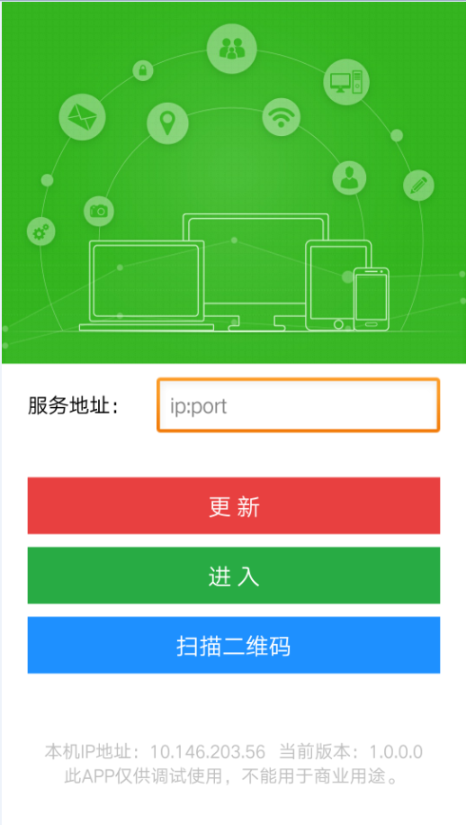
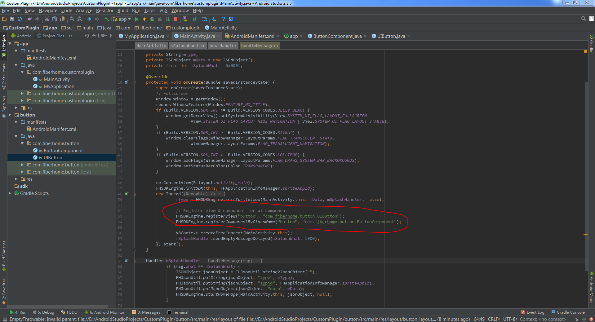

#  Android原生插件开发

----------  

<h2 id="cid_0">概述</h2>  

Android原生插件开发分为UI插件和功能插件，其中功能插件又分为单例插件和多例插件。  

单例插件继承于FHSingletonComponent。  

多例插件继承于FHMultitonComponent。  

UI插件继承于FHUIComponent，其中UI插件分为两个部分，一个是视图控件，继承于FHView，主要用于界面展示和用户交互部分；另外一个是JS对象，继承于FHUIComponent，主要用于js中的处理。  

<h2 id="cid_0">环境搭建</h2>   

1：开发环境：Android studio 2.3.1及以上  

2：EDN论坛下载Sprite[  Android原生开发工程](https://www.exmobi.cn/downloadRedirect.jsp?type=sprite_plugin_android)，该工程与EDN打包工程相同，包含Sprite基础SDK aar包，基础SDK使用的第三方库等  

3：运行该工程，若一切正常则可进入如下图所示Sprite界面  

<h2 id="cid_0">插件开发</h2>   

**基础类说明** 

 Sprite已经提供了完善的插件开发及加载相关机制，开发者只需要继承插件基础类，重载关键方法，即可快速实现插件开发。  

其中FHUIComponent，FHMultitonComponent，FHSingletomComponent均继承于FHComponent，组件开发时类相关方法说明如下。

**FHUIView 的方法 ：**  

> **init () : void**   初始化函数  
> 
> **registerEvent () : void**	注册触摸事件   
> 
> **getSysView () : View**    获取系统View  
> 
> **addSubView (FHDomObject child) : void** 	插入子节点   
> 
> 参数:   
> child -- 待添加子节点dom对象
> 
> 
> **removeChild (FHDomObject child) : void** 	去除子节点 
> 
> 参数:    
> child -- 待删除子节点dom对象  
> 
> 
> **updateAttribute () : void ** 	更新属性 
> 
> 
> **updateStyle () : void ** 	更新样式   
> 
> 
> **textChanged (boolean isInit) : void **	文本修改后处理  
> 
> 参数:  
> isInit -- 是否在初始化时调用。若设为 false, 表示通过 js 调用，如果样式影响了布局，需要通知布局刷新。  
> 
> 
> **attributeChanged (String attrName, String attrValue, boolean isInit) : void** 	属性修改后处理  
> 
> 参数:   
> attrName -- 属性名  
> attrValue -- 属性值  
> isInit -- 是否在初始化时调用。若设为 false, 表示通过 js 调用，如果样式影响了布局，需要通知布局刷新。   
> 
> **cssChanged (String styleName, String styleValue, boolean isInit) : boolean** 	样式修改后处理  
> 
> 参数:   
> styleName -- 属性名  
> styleValue -- 属性值  
> isInit -- 是否在初始化时调用。若设为 false, 表示通过 js 调用，如果样式影响了布局，需要通知布局刷新。    
> 
> **setBackgroundColor (int bgColor) : void**	设置背景颜色 
> 
> **updateBorder () : boolean**	更新边框  
> 
> 返回值: 是否更新  
> 
> **createChildView () : void**  	遍历创建所有子节点   
> 
> **updateChildView () : void**	遍历更新所有子节点   
> 
> **updateChildFrame () : void**	遍历刷新子节点布局   
> 
> **update() : void**	 更新界面，包括样式、属性和文本   
> 
> **updateFinish () : void**	更新样式和属性结束后调用  
> 
> **updateFrame () : void**	刷新布局  
> 
> **preferenceChanged () : void** 	通知刷新CSS Node  
> 
> **postInvalidate () : void**	通知系统调用onDraw方法 
> 
> **measure (YogaNodeAPI yogaNodeAPI, float width, YogaMeasureMode widthMeasureMode, float height, YogaMeasureMode heightMeasureMode) : void**	    控件测量函数   
> 
> 参数:   
> yogaNodeAPI -- CSS Node API  
> width -- 宽度  
> widthMeasureMode -- 宽度模式  
> height -- 高度  
> heightMeasureMode -- 高度模式    
> 
> **setFrame (Size size, Rect rect) : void**	 设置控件Frame  
> 
> 参数:   
> size -- 控件尺寸  
> rect -- 控件矩形区域  
> 
> 
> **parseStylePath (String oldPath) : String**	解析样式路径 
> 
> **parseAttrPath (String oldPath) : String**	解析属性路径 
> 
> **onResume () : void**	 处理Activity onResume事件(view可见) 
> 
> **onChildResume () : void**	 子节点处理Activity onResume事件(view可见) 
> 
> **onPause () : void**	处理Activity onPause 事件(view不可见或者被遮挡) 
> 
> **onChildPause () : void**	子节点处理Activity onPause 事件(view不可见或者被遮挡)   
> 
> **destroy () : void**	  销毁对象 

 **FHComponent 的方法 ：**

> **on (String[] params) : void**	注册事件
> 
> **fire (String[] params) : void**	触发事件  
> 
> **off(String[] params) : void**	移除事件 
> 
> **getOn(String[] params) : int[]**  	获取已注册事件函数列表

**FHUIComponent 的方法 ：**  

> **on (String[] params) : void**	注册事件  
> 
> **fire (String[] params) : void**	触发事件  
> 
> **off(String[] params) : void**	移除事件  
> 
> **getOn(String[] params) : int[]	**  获取已注册事件函数列表  
> 
> **getFrame (String[] params) : JSONObject** 	获取控件Frame  
> 
> **setFrame (String[] params) : void**	设置控件Frame  
> 
> **getCenter (String[] params) : JSONObject**	 获取中心点坐标  
> 
> **getAbsoluteFrame (String[] params) : JSONObject**  	获取控件绝对布局Frame  
> 
> **getParent (String[] params) : JavaScriptObject**  	获取父节点  
> 
> **getNext (String[] params) : JavaScriptObject**	获取相邻的后一个兄弟节点  
> 
> **getPrevious (String[] params) : JavaScriptObject**	获取相邻的前一个兄弟节点  
> 
> **remove (String[] params) : void**	去除当前节点  
> 
> **clone (String[] params) : JavaScriptObject** 	克隆一个节点  
> 
> **setText (String[] params) : void**	设置文本  
> 
> **getText (String[] params) : ParamObject**	获取文本  
> 
> **getAttr (String[] params) : String**	获取节点某个属性  
> 
> **getAttrs (String[] params) : JSONObject**	获取节点所有属性  
> 
> **removeAttr (String[] params) : void**	删除某个属性  
> 
> **hasAttr (String[] params) : boolean**	是否包含某个属性  
> 
> **setAttr (String[] params) : void**	设置某个属性  
> 
> **getId (String[] params) : String**	获取节点的ID  
> 
> **getTag (String[] params) : String**	获取节点的TAG  
> 
> **getStyle (String[] params) : String **	获取节点某个样式  
> 
> **clearStyle (String[] params) : void	** 清除节点所有样式  
> 
> **setStyle (String[] params) : void**	设置节点某个样式  
> 
> **getClassStyle (String[] params) : String**	获取节点的class样式  
> 
> **setClassStyle (String[] params) : void**	设置节点的class样式  
> 
> **getElement (String[] params) : JavaScriptObject**	获取某个节点  
> 
> **getElements (String[] params) : JavaScriptObject[]**	 获取符合rule值的所有节点  
> 
> **getChildren (String[] params) : JavaScriptObject[]**	获取所有子节点  
> 
> **getFirstChild (String[] params) : JavaScriptObject**	获取第一个子节点  
> 
> **getLastChild (String[] params) : JavaScriptObject**	获取最后一个子节点  
> 
> **appendChild (String[] params) : void**	在末尾添加一个子节点  
> 
> **replaceChild (String[] params) : void**	替换某个节点  
> 
> **insertBefore (String[] params) : void** 	在某个节点前插入一个节点  
> 
> **insertAfter (String[] params) : void**	在某个节点后插入一个节点  
> 
> **clear (String[] params) : void** 	清除所有子节点  
> 
> **startAnimation (String[] params) : void**	启动组件动画  
> 
> **startAnimator (String[] params) : void** 	启动属性动画  
> 
> **releaseAnimator (String[] params) : void**	暂停属性动画  
> 
> **startKeyFrameAnimator (String[] params) : void**	启动帧动画  
> 
> **getInnerHTML (String[] params) : String** 	获取HTML

**IFHActivityResultListener** 

> **handleActivityResult(int requestCode, int resultCode, Intent data):void	** 页面Activity回调函数  
> 
> 参数：  
> requestCode：确认返回的数据是从哪个Activity返回的，这个requestCode和startActivityForResult中的requestCode相对应
> resultCode：由上层Activity通过其setResult()方法返回
> data：一个Intent对象，带有返回的数据  

**UI插件开发**  

开发过程说明：

#### 1. 建立一个壳工程。
新建一个 android 工程的时候，android studio 会自动创建一个 app 模块。我们需要新建一个 application 类，继承系统的 application 类，在它的 onCreate 方法中添加  `FHSDKEngine.initSpriteApplication(this);` 初始化 sprite application。

创建 application 之后，需要在 AndroidManifest.xml 中引用它`android:name=".MyApplication"`。

接着我们需要初始化 sprite sdk。

#### 2. 新建一个 SDK 模块。
sdk 模块是从 sdk-release.aar 创建得到。

#### 3. 新建一个组件模块。
button 模块是一个 android library 模块。

首先在 button 模块的 build.gradle 文件中添加必要的依赖，这样就可以使用 sprite sdk 中的 api 了。

接着我们创建 view 和 component 了。

写完 view 和 component 之后，我们需要回到 MainActivity 中注册 view `FHSDKEngine.registerView("button", "com.fiberhome.button.UIButton");`和注册 component `FHSDKEngine.registerComponentByClassName("button", "com.fiberhome.button.ButtonComponent");`。

此外，还需要在 app 模块中的 build.gradle 文件中引用 button 组件。

