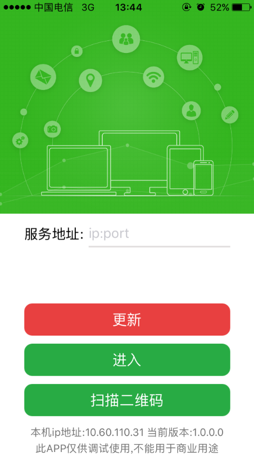
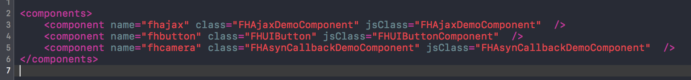
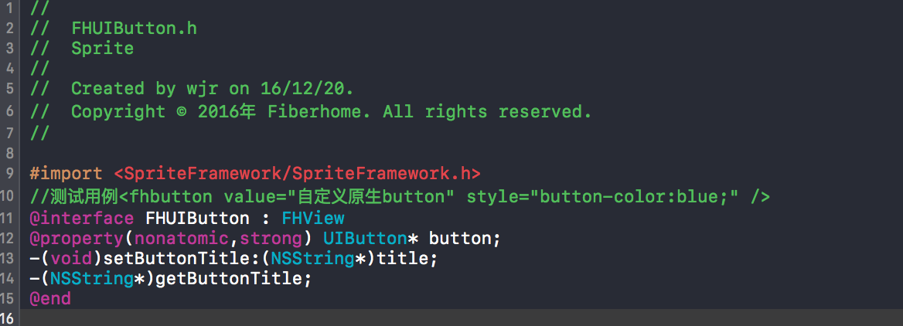
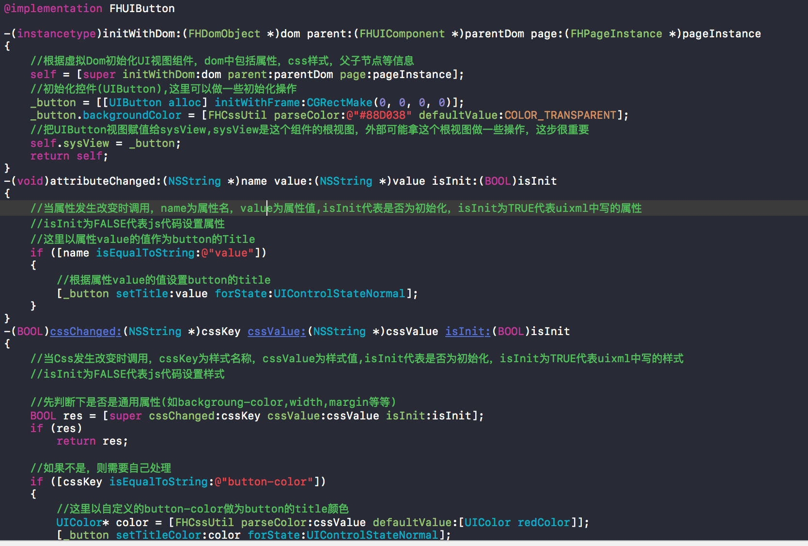
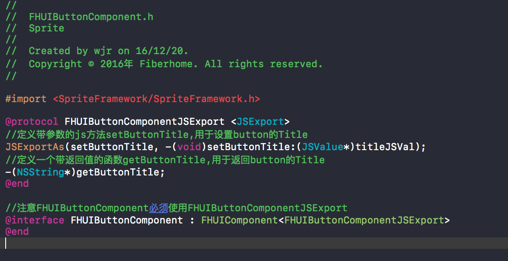
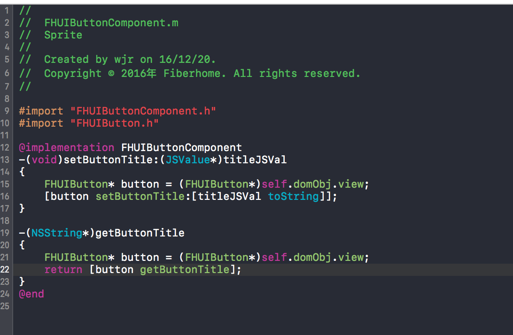
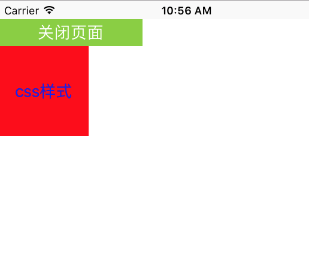

# IOS原生插件开发

----------

<h2 id="cid_0">概述</h2>  


IOS原生插件开发分为UI插件和功能插件，其中功能插件又分为单例插件和多例插件。  

单例插件继承于FHSingletonComponent。  

多例插件继承于FHMultitonComponent。  

UI插件继承于FHUIComponent，其中UI插件分为两个部分，一个是视图控件，继承于FHView，主要用于界面展示和用户交互部分；另外一个是JS对象，继承于FHUIComponent，主要用于js中的处理。  

<h2 id="cid_1">关于javascriptcore</h2>  

IOS采用系统javascriptcore作为js引擎，具有安装包体积小，原生桥接方便等特点

参考文档1： iOS7新JavaScriptCore框架入门介绍 http://www.cnblogs.com/ider/p/introduction-to-ios7-javascriptcore-framework.html

参考文档2 ：JavaScriptCore and iOS 7  https://www.bignerdranch.com/blog/javascriptcore-and-ios-7/


<h2 id="cid_2">环境搭建</h2>   


1：开发环境：Xcode8.3及以上；Mac系统：建议10.12及以上  

2：EDN论坛下载Sprite[  IOS原生开发工程](https://www.exmobi.cn/downloadRedirect.jsp?type=sprite_plugin_ios)，该工程与EDN打包工程相同，包含Sprite基础SDK Framework，基础SDK使用的第三方库，外置组件相关； 

3：运行该工程，若一切正常则可进入如下图所示Sprite界面  


 

<h2 id="cid_2">插件开发</h2>   

**关于component.xml文件** 

 在工程中有一个component.xml,原生组件主要通过此文件反射进行组件扩展，每一个component节点对应一个原生组件，所以component.xml可以包括多个组件(UI组件，单例组件，多例组件)如图所示   




> **component.name**      对于功能组件,name的配置就是uixml使用中require的字段，
>                         例如 FHAsynCallbackDemoComponent组件,使用时用require("fhcamera"); 
>                         对于UI组件name就为uixml中ui节点的tagName,以FHUIButtomComponent为例子,
>                         在uixml中就可以写<fhbutton value="123"/> 
> 
> **component.class**     对于UI组件，class配置就是视图控件对应的类名，对于功能组件，同jsClass一样，都是js类名 
> 
> **component.jsClass**   获取系统View  


**基础类说明** 

 Sprite已经提供了完善的插件开发及加载相关机制，开发者只需要继承插件基础类，重载关键方法，即可快速实现插件开发。  

其中FHUIComponent，FHMultitonComponent，FHSingletomComponent均继承于FHComponent，组件开发时类相关方法说明如下。

**FHUIView 的方法 ：**  

> **-(instancetype)initWithPage:(FHPageInstance*)pageInstance**   初始化函数  
> 
> **-(void)willResignActive**	即将切换到后台   
> 
> **-(void)didEnterBackground**    进入后台  
> 
> **-(void)willEnterForeground** 	即将切换到前台   
> 
> **-(void)didBecomeActive** 	进入前台 
> 
> **-(void)viewWillAppear** 	    ViewController viewWillAppear事件
> 
> **-(void)viewWillDisappear** 	ViewController viewWillDisappear事件   
> 
> **-(void)onPageDestroy**	    页面即将销毁时调用,此后会调用destroy方法  
> 
> **-(void)destroy** 	页面销毁时调用     
> 
> **+(void)onEngineInitEvent:(NSDictionary*)dic** 	引擎初始化通知，主要用于百度地图等初始化时调用  
> 
> **+(BOOL)application:(UIApplication *)application openURL:(NSURL *)url**
> **sourceApplication:(NSString *)sourceApplication annotation:(id)annotation**	处理回调（浏览器打开程序、第三方app回调等） 
> 
> **+(void)application:(UIApplication *)application** 
> **didRegisterForRemoteNotificationsWithDeviceToken:(NSData *)deviceToken**	Push获取deviceToken  
> 
> **+(void)application:(UIApplication*)application didReceiveRemoteNotification:(NSDictionary*)userInfo**
> **appInstance:(FHAppInstance*)appInstance**  	Ios8-9获取Push   
> 
> **+(void)userNotificationCenter:(UNUserNotificationCenter*)center didReceiveNotificationResponse:(UNNotificationResponse*)**
> **response appInstance:(FHAppInstance*)appInstance**	ios10 程序在后台运行时收到的Push消息   
> 
> **+(void)userNotificationCenter:(UNUserNotificationCenter*)center willPresentNotification:(UNNotification*)notification**
> **appInstance:(FHAppInstance*)appInstance**	ios10 程序在前台运行时收到的Push消息   
> 
> **-(void)remoteControlReceivedWithEvent:(UIEvent*)receivedEvent**	 远程事件通知回调   
> 
> **-(BOOL)isOnEvent:(NSString*)eventName**	判断是否监听了某一事件  
> 
> **-(JSValue*)fire:(NSString*)eventName target:(id)target thisObj:(id)thisObj paramArray:(NSArray*)paramArray**	组件fire事件  
> 
> **-(NSArray*)getOnEvents:(NSString*)eventName** 	获取监听事件的functions数组(JSValue) 
> 


开发过程说明：

#### 1. 建立工程。
基于官方提供的插件工程包，包含了sprite核心框架framework，在此工程基础上进行开发。

#### 2. 下面以UI组件(fhbutton)开发为例子
新建一个OC类FHUIButton继承于FHView,如图所示 





#### 相关函数说明

>**-(void)loadComplete**	页面加载结束时会调用此函数，但是此时页面还没有Push到navigationcontroller中
>
>**-(void)openPageAnimationFinished**	页面Push到navigationcontroller中,并且开窗动画完毕以后的回调
>
>**-(void)viewDidAppear**	ViewController viewDidAppear事件
>
>**-(void)viewWillAppear**	ViewController viewWillAppear事件
>
>**-(void)viewDidDisappear**	ViewController viewDidDisappear事件
>
>**-(void)viewWillDisappear**	ViewController viewWillDisappear事件
>
>**-(void)didBecomeActive**	进入前台回调
>
>**-(void)willEnterForeground**	即将进入前台
>
>**-(void)willResignActive**	即将进入后台
>
>**-(void)resizeCompleted**	横竖屏切换完成
>
>**-(void)onPagePause**	页面处于非激活时调用
>
>**-(void)onPageResume**	页面处于激活时调用
>
>**-(void)onPageDestroy**	页面即将销毁时调用,此后会调用destroy方法
>
>**-(void)destroy** 	页面销毁时调用
>
>**-(void)setLayoutFrame:(CGRect)rect** 	当组件大小改变时会调用
>
>**-(BOOL)cssChanged:(NSString *)cssKey cssValue:(NSString *)cssValue isInit:(BOOL)isInit**
>	当Css改变时会调用，cssKey:css的名称,cssValue:css的值,isInit为true的时候表示是xml中设置的样式，为false时表示是通过js方式设置的样式，注>   意当cssValue为nil的时候，表示清除了控件的样式
>
>**-(void)attributeChanged:(NSString *)name value:(NSString *)value isInit:(BOOL)isInit**	当属性改变时会调用，name:属性的名称,
>   value:属性的值,isInit为true的时候表示是xml中设置的属性，为false时表示是通过js方式设置的属性，
>   注意当value为nil的时候，表示清除了控件的属性
>
>**-(instancetype)initWithDom:(FHDomObject *)dom parent:(FHUIComponent *)parentDom page:(FHPageInstance *)pageInstance**初始化方法
>
>**-(CGSize)measureSize:(CGSize)size rootViewSize:(CGSize)rootViewSize**	控件测量函数，默认返回值是
>   CGSize(FHCSSUndefined,FHCSSUndefined) size为css的宽高，如果宽高都没写,size为(FHCSSUndefined,FHCSSUndefined) 
>   如果只写了宽度width:100 则size(100,FHCSSUndefined) 如果只写了宽度height:100 则size(FHCSSUndefined,100) 
>   如果只写了宽度width:100;height50 则size(100,50) rootViewSize 为页面个宽度高度 
>   这里返回的值不一定是控件的真实宽高，真实的宽高还要根据css的设置还决定，毕竟css的优先级最高比如(width,height,flex), 
>   例如css写了width:100; 这里的函数返回CGSize(500,100),最终实际宽度还是按照css的100来设置的
>
>**-(void)remoteControlReceivedWithEvent:(UIEvent*)receivedEvent**	远程事件通知回调 
>


```java
// 
//  FHUIButton.m 
//  Sprite 
// 
//  Created by wjr on 16/12/20. 
//  Copyright © 2016年 Fiberhome. All rights reserved. 
// 
 
#import "FHUIButton.h" 
 
@implementation FHUIButton 
 
-(instancetype)initWithDom:(FHDomObject *)dom parent:(FHUIComponent *)parentDom page:(FHPageInstance *)pageInstance 
{ 
    //根据虚拟Dom初始化UI视图组件，dom中包括属性，css样式，父子节点等信息 
    self = [super initWithDom:dom parent:parentDom page:pageInstance]; 
    //初始化控件(UIButton),这里可以做一些初始化操作 
    _button = [[UIButton alloc] initWithFrame:CGRectMake(0, 0, 0, 0)]; 
    _button.backgroundColor = [FHCssUtil parseColor:@"#88D038" defaultValue:COLOR_TRANSPARENT]; 
    //把UIButton视图赋值给sysView,sysView是这个组件的根视图，外部可能拿这个根视图做一些操作，这步很重要 
    self.sysView = _button; 
    return self; 
} 
-(void)attributeChanged:(NSString *)name value:(NSString *)value isInit:(BOOL)isInit 
{ 
    //当属性发生改变时调用，name为属性名，value为属性值,isInit代表是否为初始化，isInit为TRUE代表uixml中写的属性 
    //isInit为FALSE代表js代码设置属性 
    //这里以属性value的值作为button的Title 
    if ([name isEqualToString:@"value"]) 
    { 
        //根据属性value的值设置button的title 
        [_button setTitle:value forState:UIControlStateNormal]; 
    } 
} 
-(BOOL)cssChanged:(NSString *)cssKey cssValue:(NSString *)cssValue isInit:(BOOL)isInit 
{ 
    //当Css发生改变时调用，cssKey为样式名称，cssValue为样式值,isInit代表是否为初始化，isInit为TRUE代表uixml中写的样式 
    //isInit为FALSE代表js代码设置样式 
     
    //先判断下是否是通用属性(如backgroung-color,width,margin等等) 
    BOOL res = [super cssChanged:cssKey cssValue:cssValue isInit:isInit]; 
    if (res) 
        return res; 
     
    //如果不是，则需要自己处理 
    if ([cssKey isEqualToString:@"button-color"]) 
    { 
        //这里以自定义的button-color做为button的title颜色 
        UIColor* color = [FHCssUtil parseColor:cssValue defaultValue:[UIColor redColor]]; 
        [_button setTitleColor:color forState:UIControlStateNormal]; 
        return TRUE; 
    } 
    return FALSE; 
} 
 
-(void)setLayoutFrame:(CGRect)rect 
{ 
    //当宽度和高度改变时，会调用此函数 
} 
 
-(void)onPageDestroy 
{ 
    [super onPageDestroy]; 
    //当页面即将关闭时，会调用此函数，在此函数中做一些预销毁的操作，如停止动画，停止定时器等等 
} 
-(void)destroy 
{ 
    [super destroy]; 
    //当页面销毁时调用，这里需要处理销毁动作 
} 
 
-(void)loadComplete 
{ 
    //加载完毕时，会调用此函数 
    [super loadComplete]; 
     
    //fire自定义事件,ary可以为nil 
    NSArray* ary = [[NSArray alloc] initWithObjects:@"参数1",@"参数2", nil]; 
    [self fireEvent:@"fhbuttonloaded" withArray:ary]; 
     
    //注册点击事件 
    [_button addTarget:self action:@selector(click:) forControlEvents:UIControlEventTouchUpInside]; 
} 
 
-(void)openPageAnimationFinished 
{ 
    //页面开窗动画结束回调 
} 
 
-(void)viewDidAppear 
{ 
    //ViewController viewDidAppear事件 
} 
 
-(void)viewWillAppear 
{ 
    //ViewController viewWillAppear事件 
} 
 
-(void)viewDidDisappear 
{ 
    //ViewController viewDidDisappear事件 
} 
-(void)viewWillDisappear 
{ 
    //ViewController viewWillDisappear事件 
} 
 
-(void)didBecomeActive 
{ 
    //进入前台回调 
} 
-(void)willEnterForeground 
{ 
    //即将进入前台 
} 
-(void)willResignActive 
{ 
    //即将进入后台 
} 
-(void)didEnterBackground 
{ 
    //进入后台 
} 
-(void)resizeCompleted 
{ 
    //横竖屏切换完成 
} 
-(void)onPagePause 
{ 
    //页面处于非激活时调用 
} 
-(void)onPageResume 
{ 
    //页面处于激活时调用 
} 
-(void)remoteControlReceivedWithEvent:(UIEvent*)receivedEvent 
{ 
    //远程事件通知回调 
} 
-(void)click:(id)sender 
{ 
    //fire click事件 
    [self fireEvent:@"click" withArray:nil]; 
} 
 
-(CGSize)measureSize:(CGSize)size rootViewSize:(CGSize)rootViewSize 
{ 
    //控件测量函数，默认反正值是CGSize(FHCSSUndefined,FHCSSUndefined) 
    //size为css的宽高，如果宽高都没写,size为(FHCSSUndefined,FHCSSUndefined) 如果只写了宽度width:100 则size(100,FHCSSUndefined) 
    //如果只写了宽度height:100 则size(FHCSSUndefined,100) 如果只写了宽度width:100;height50 则size(100,50) 
    //rootViewSize 为页面个宽度高度 
    //这里返回的值不一定是控件的真实宽高，真实的宽高还要根据css的设置还决定，毕竟css的优先级最高比如(width,height,flex), 
    //例如css写了width:100; 这里的函数返回CGSize(500,100),最终实际宽度还是按照css的100来设置的 
    return CGSizeMake(160, 30); 
} 
-(void)setButtonTitle:(NSString*)title 
{ 
    [_button setTitle:title forState:UIControlStateNormal]; 
 
} 
-(NSString*)getButtonTitle 
{ 
    return _button.titleLabel.text; 
} 
@end 


```

####  3.下面建立js类FHUIButtonComponent，新建一个oc类FHUIButtonComponent，继承于FHUIComponent,如图所示 





#### 4.配置工程，找到工程中的component.xml,增加<component name="fhbutton" class="FHUIButton" jsClass="FHUIButtomComponent" /> 
让程序反射扩展UI组件

#### 5.UIXML中使用插件
    
    <fhbutton id="close" value="关闭页面" /> 
    
    <fhbutton style="background-color:red;button-color:blue;width:100;height:100" value="css样式" />

#### 6.手机效果

   